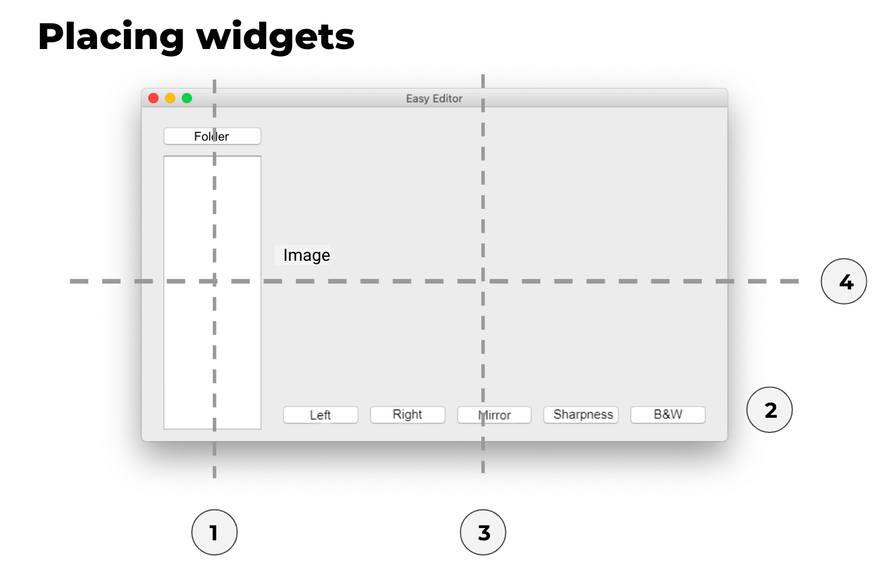
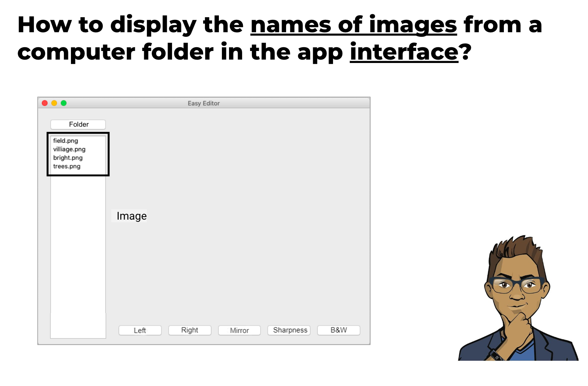
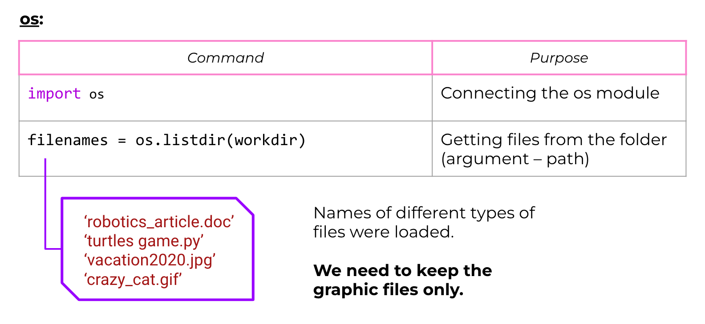
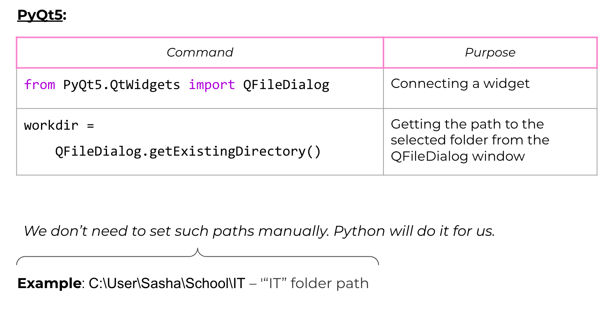

# easy-editor-application

### Task 1. Create an interface for the application.

#### 1) Import the necessary modules from the PyQt5 library.
#### 2) Create an application object (and application window).
#### 3) Create widgets: 
    — A folder button,
    — A list with items selected, 
    — An image label,
    — A set of buttons for editing photos: “Left,” “Right,” “Mirror,” “Sharpness,” “B/W.”
#### 4) Place the buttons on the layouts.
#### 5) Run the software and adjust the interface, if necessary.

### Task 2. Program the display of a set of images (from a random folder) in the widget

#### 1) Import the os module.

#### 2) Program the processing of pressing the Folder button.

##### 2.1. Create the chooseWorkdir() function to select the work folder. Use the following command: QFileDialog.getExistingDirectory(). The work folder is defined as a global variable.

##### 2.2. Create the filter() function to select files of suitable formats from the list. Use the filename.endswith(extension) command in order to find out whether the filename field ends with the extension line.

##### 2.3. Create the handler function for the Folder button click. The function will allow you to select the folder (referring to chooseWorkdir()) and files with graphic extensions (referring to filter()), as well as to display the list of graphic file names in the list widget.

#### 3) Enable event handling. Run the software and make sure that the widget is filled with the names of graphic files.

### Task 3. Program thumbnails

Program the display of thumbnails when clicking on the file name in the list widget.

#### 1) Create the ImageProcessor class with the following fields:
    – Current image (Image object),
    – Current file name (of such image).
    And methods:
    – loadImage() — loading of images from the work folder into the image field according to the file name selected in the list.
    – showImage() — display of images in the application window.

In the main part of the software, create an instance of the ImageProcessor class — workimage.

#### 2) Create the showChosenImage() function to get the name of the selected file from the list widget and display it in the application window. The function should use the loadImage() and showImage() methods.

### Task 4. Implement a black and white filter overlay.

Add two methods to the ImageProcessor class:

#### 1) do_bw(), which applies the black and white filter to the current photo (image field).
#### 2) saveImage(), which saves the edited image to the Modified subfolder of the work folder.

Process the click on the B/W button using the do_bw() method. Use Explorer or Finder in order to open the selected work folder and check whether everything was saved.
